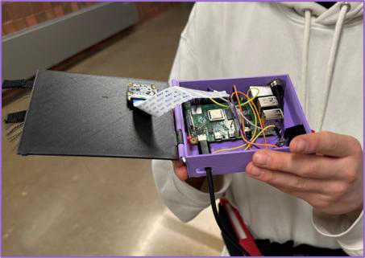
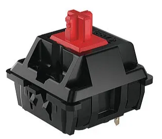

# Project 3: D.E.L.P.H.I (Detecting, Examining, Locating, Hearing, and Identification)

**Tech Stack:** Raspberry Pi 4, Python, Bash, Google Vision API, OpenAI API, KiCAD, 3D Printing (Autodesk Inventor)  
**Role:** Electrical + Software Lead  
**Key Results:** Built wearable object & text recognition device with Bluetooth audio output in ~4s latency; <$100 BOM; tested with >80% accuracy in bright light.

**Video of final presentation**

## Project Narrative

---

**Problem**  
Individuals with visual and auditory impairment struggle with navigating activities like cooking, hiking, reading labels, etc. Many modern solutions are hard to use, heavy, and expensive. A cost-effective and easy-to-use solution is needed that can identify objects while accommodating auditory challenges.

**Proposed Solution**  
The team designed an audio-camera system capable of recognizing objects/labels and delivering accurate auditory descriptions of nearly anything. This project was developed for people with Usher Syndrome but is useful for anyone with mild to moderate vision loss. 

**Key Objectives**  
Accurate, high battery-life, responsive, intuitive, audible, comfortable, and portable. Should work in a wide variety of environments, both light/dark and quiet/noisy.

**Key Constraints**  
Within $100; no irritating flashes or sudden beeps.

**Key Functions**  
Identifies objects and text, attached to a belt and discreetly worn over or under a jacket.

**Size of Team**  
4 Engineering students

---

## Personal Contributions

- The work was divided into two parts: electrical & software and mechanical.
- As the only team member with significant microcontroller and programming experience, I handled all electrical and software work.
- I provided initial sketches, PCB drawings, a software flowchart, GitHub code, and component images.
- I supplied all electrical components from home to reduce costs.
- I soldered all components and maintained regular updates with the team.

### Initial Sketches

**1st refinement:**
- Custom PCB design with Raspberry Pi 5, haptics sensors, camera, and touch sensor.
- Selected components for cost and availability (DigiKey + SnapEDA).
- Compared STM32 (smaller, less powerful) vs Raspberry Pi 5 (larger, more capable).
- Final choice: Raspberry Pi 5 for power and familiarity.

### 3rd Refinement

Problems identified:
- Speaker played sound out loud → replaced with Bluetooth audio for discreetness.
- Touch sensor gave no feedback → replaced with red push button.
- Pi 5 over budget → replaced with Pi 4.

  
Source: [Raspberry Pi 5 Features](https://cdn.shopify.com/s/files/1/0254/1191/1743/files/5047-5048_description-raspberry-pi-5-features.jpg?v=1695822743)

### Physical Components

- Red push button
- Red switch
- Raspberry Pi 4
- PiCAM 2 NOIR
- Power bank

  

**Software Flowchart:**  
[Lucidchart Flowchart 1](https://lucid.app/lucidchart/55d20da2-2d73-404f-b704-1dcab99b2e3a/edit?viewport_loc=-416%2C648%2C2557%2C1433%2C0_0&invitationId=inv_b5584151-e2d5-41c1-999f-738562a439ca)  
[Lucidchart Flowchart 2](https://lucid.app/lucidchart/55d20da2-2d73-404f-b704-1dcab99b2e3a/edit?invitationId=inv_b5584151-e2d5-41c1-999f-738562a439ca&page=0_0#)

---

## Results

- Hardware and software successfully integrated.
- Button press → camera capture → image processing → API query → Bluetooth audio output (~4s latency).
- Mode switch toggles between text and object detection.

---

## Team Contributions

- Mechanical team handled CAD for Pi and power bank cases.
- Suggested gluing Pi and camera into place.
- Designed discreet square hip enclosure.
- Considered overheating risks and space constraints.
- Omitted haptic feedback due to power usage.

  
  
  

---

**Software Used**  
- Python  
- Bash scripting  
- mpg321  
- Google Vision API  
- OpenAI API  
- Remove BG API  

**Full Code:**  
[GitHub Repository](https://github.com/vjhawar12/DELPHI/tree/master)

---

## Mechanical Components

**Pi Holder:**  
  

**Power Bank Case:**  
  

**All Components on Belt:**  

- Belt  
- Pi holder CAD  
- Power bank case CAD  

---

## Testing Plan & Results

- Gathered feedback from classmates, TAs, and bystanders.
- Morph chart for function brainstorming:  

- Decision matrix for design choices:  

**Testing Goals:**  
- Maximize accuracy, speed, battery life, comfort, clarity  
- Minimize latency

**Results:**  
- Light/dark/blurry accuracy comparison:  

- Latency measurement:  

- Ease-of-use survey:  
 – Avg. 4.67/5  
- Voice quality survey:  
 – Avg. 4.83/5  

---

## Reflection

### Key Mistakes
- Overheating Pi before presentation due to showing off → lost competition.
- Damaging PiCAM by mishandling during late-night debugging.
- Poor planning, overconfidence, lack of budget buffer.

### Questioning Assumptions
- Glasses-mounted Pi was possible (initially dismissed without research).
- Working alone would be faster (proved false).
- Budget would remain under $100 (did not account for replacements).

### Design Alternatives
- Pi Zero for smaller form factor.
- Local VLM instead of external APIs.
- PiCAM V3 for better performance.

### Skills Learned
- Advanced Raspberry Pi programming and GPIO use.
- Python + shell scripting integration.
- Building a CNN for computer vision.
- Google Cloud Platform for storage.
