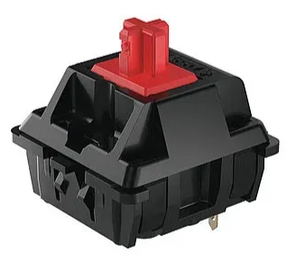

# Project 3: D.E.L.P.H.I — Deep Embedded Learning for Perception, Hearing, and Identification ​

## Project Narrative

---

Inside of Pi Holder

Full demonstration of product with belt and power bank

**Problem**

Individuals with visual and auditory impairment struggle with navigating activities like cooking, hiking, reading labels, etc. Many modern solutions are hard to use, heavy, and expensive. A cost-effective and easy-to-use solution is needed that can identify objects while accommodating auditory challenges.

**Proposed solution**

The team designed a audio-camera system capable of recognizing objects/labels and delivering accurate auditory descriptions of nearly anything. This project was developed for people with Usher Syndrome but is useful for anyone with mild to moderate vision loss. 

**Key objectives**

Accurate, high battery-life, responsive, intuitive, audible, comfortable, and portable. Should work in a wide variety of environments, both light/dark and quiet/noisy.   

**Key constraints**

Within $100; no irritating flashes or sudden beeps. 

**Key functions**

Identifies objects and text, attached to a belt and discreetly worn over or under a jacket.   

**Timeline**

February 10th - April 4th 

**Size of team**

 4 Engineering students    

---

## Personal Contributions

- The work was divided into two parts: electrical & software and mechanical.
- Being the only team member of the four with the most microcontroller and programming experience (having worked on PIs and Arduino in both high school and University Engineering teams), I took on the entirety of electrical and software alone.
- Listed below are my initial sketches, PCB drawings, software flowchart, GitHub code link, and component images.
- I also brought all the electrical components needed from home to minimize cost.
- Furthermore, I soldered everything too.
- Together with my team, I held several meetings regarding updates on the electronics and code.
- I kept my team updated with what was going on, frequently asked for feedback, and vice versa.

**Initial sketches**

Initial sketch 1

**1st refinement**

- Right-side image shows a custom PCB design featuring:
    - Raspberry Pi 5
    - Sensors for haptics
    - Camera (for photo capture)
    - Touch sensor (to activate camera)
- Component models selected based on:
    - Price and availability on DigiKey
    - SnapEDA used for obtaining symbols (used in the diagram to determine wiring connections)
- Camera not included on the PCB itself
    - A plug-and-play version was chosen for simplicity

- Initial sketches show PCB arrangements
- Right-side sketch uses STM32
    - Smaller but less powerful
- Left-side sketch uses Raspberry Pi 5
    - Larger but more capable
- Sensor differences:
    - Left image: vibration motor for haptics
    - Right image: ultrasonic sensor for distance gauging
- Final decision used a PI
    - Chosen for its higher capability, power, and my comfortability with it
    

Initial sketch 2

Initial PCB design made on KiCAD

1st refined PCB design made on KiCAD

**3rd refinement**

I noticed several problems were noted in current design: 

- a speaker played sound out loud, thus contradicting the ‘discreetness’ function
- the touch sensor would not give feedback when it was pressed
- The Pi 5 was out of budget (> $100)

I sought to solve them as such: 

- Swapping the speaker with a Bluetooth-audio system that played sound directly in hearing aids or any connected device
- Replacing the touch sensor with a red push button (right)
- Using a PI 4 (had similar functionality anyways) instead
- I also added a switch to toggle between object detection and text recognition modes. This just improved the range of functionality our product offered to interested customers.

](image%206.png)

Layout of PI: [https://cdn.shopify.com/s/files/1/0254/1191/1743/files/5047-5048_description-raspberry-pi-5-features.jpg?v=1695822743](https://cdn.shopify.com/s/files/1/0254/1191/1743/files/5047-5048_description-raspberry-pi-5-features.jpg?v=1695822743)

**Physical components**

The following include the final list of physical components used:

- Red push button (right + above)
- Red switch (right)
- Raspberry Pi 4 (above)
- PICAM 2 NOIR (right + above)
- Power bank (right)

Old amplifier and speaker system

The image on the left is the old speaker and amplifier system which was replaced for Bluetooth audio, enabling discreetness and higher quality audio. The one on the right is a close-up of the 8 ohm 0.4 W speaker used before the update. 

Close-up of speaker

### **Software flowchart**

[https://lucid.app/lucidchart/55d20da2-2d73-404f-b704-1dcab99b2e3a/edit?viewport_loc=-416%2C648%2C2557%2C1433%2C0_0&invitationId=inv_b5584151-e2d5-41c1-999f-738562a439ca](https://lucid.app/lucidchart/55d20da2-2d73-404f-b704-1dcab99b2e3a/edit?viewport_loc=-416%2C648%2C2557%2C1433%2C0_0&invitationId=inv_b5584151-e2d5-41c1-999f-738562a439ca)

[https://lucid.app/lucidchart/55d20da2-2d73-404f-b704-1dcab99b2e3a/edit?invitationId=inv_b5584151-e2d5-41c1-999f-738562a439ca&page=0_0#](https://lucid.app/lucidchart/55d20da2-2d73-404f-b704-1dcab99b2e3a/edit?invitationId=inv_b5584151-e2d5-41c1-999f-738562a439ca&page=0_0#)

### **Results**

- I was able to get the hardware and software working.
- When a button was pushed, our camera would take a photo, process it, and send it over to the relevant API.
- It would collect the accurate and detailed response and output it as an audio file which would play via Bluetooth while minimizing latency to ~4 seconds.
- The mode could be switched from text to object mode with a side switch.

## Team contributions

The mechanical team members kept me up-to-date with their progress regarding designs. I gave them the dimensions of the electronics and made several suggestions, including gluing the PI inside the holder to keep it fixed in place. Same with the camera. 

As mentioned earlier, the rest of the team handled the mechanical portion. They devised the CAD for the PI and the power bank, and attached all the components to the belt.

**2nd refinement**

- Team feedback highlighted the need for the design to fit inside a small, discreet square box for the hip (since we were using a belt)
- Concern raised about the Raspberry Pi overheating in a closed box
    - Could potentially melt the 3D-printed enclosure due to power-hungry components
- Limited space made it difficult to include numerous components
    - Non-essential components were considered for removal
- Haptic feedback was omitted
    - I2C motor was too power-hungry
    - Audio feedback was already present, making haptics unnecessary
    

A red push button used for activating camera

Switch toggles between object & text 

The PICAM 2 NOIR 

I swapped the black heavy power bank for the white and light power bank. 

**Software components**

The following include the software used:

- Python
- Bash scripting
- mpg321
- Google Vision API
- Open AI API
- Remove BG API

**Full code**

[GitHub - vjhawar12/Object-Identifier: AI system integrated with GCP that uploads images to Google Cloud Storage and uses Google Vision and OpenAI to give audio output (via bluetooth) about the scanned object/label.](https://github.com/vjhawar12/Object-Identifier/tree/main)

[https://github.com/vjhawar12/Object-Identifier/tree/main](https://github.com/vjhawar12/Object-Identifier/tree/main)

 **PI Holder**                                                                                                                                                                                                                    

PI Holder body

**Power bank case**

Power bank case lid

The  image on the left is the PI case holder. 

It took 2H 16M to print.

The image on the right is the lid for the PI case holder. 

It took 1H 32M to print. 

They were carefully printed to accommodate the PI and camera. On the right, a window for the camera is visible. 

This mechanical structure fitted neatly on the belt with Velcro. 

The following are images for the power bank case. 

This component was also mounted onto the belt and served as a protective enclosure for the power bank, ensuring both safety and portability.

The design includes precise cutouts for USB slots, allowing easy access to the power bank’s USB ports without removing it from the case. 

The CAD model on the left required approximately 37 minutes to print. 

In contrast, the CAD model on the right took around 3 hours and 32 minutes to print

This was also fitted on the belt with Velcro. 

PI Holder lid

Power bank case body

All components attached to belt

**Mechanical components**

- Belt
- PI holder CAD
- Power bank case CAD

### Testing plan and results

This section was carried out together by all members of the team including myself. After the electronics were wired and the prints were attached, the team sought feedback from classmates, TAs, and interested bystanders to improve the product.   

Here is a morph chart the team made to examine possible functions and means. It helped us consider what types of parts and designs would be best. 

Here is a decision matrix which we used to evaluate possible designs as a team to give us a direction forward regarding which designs to explore.

We conducted significant testing to refine the prototype. We used a mix of Google Forms and Spreadsheets in order to measure the following objectives, both quantitative and qualitative: 

- maximize accuracy
- maximize processing speed
- maximize battery life
- maximize ease of use
- maximize comfort
- minimize latency
- have a clear audio output.

The below image is a screenshot of a spreadsheet containing correctly and incorrectly identified objects classified in three main groups with a pi chart. 

The following are screenshots of more graphs. 

The bar graph above helped us compare the ratio of correctly identified objects in light vs dark vs blurry environments. The ratio was about 2:1:1 and 80% of objects were correctly identified in light environments. This meant that although the camera performs well in bright rooms, it struggles in the dark. From this, the team swapped the old camera for a PiCAM NOIR 2 which performed better in the dark, but slightly struggling in brighter environments.

 

The scatterplot above helped us determine the time between a photo being taken and audio being played. The average was ~16 seconds. The team realized this was a long time and sought to examine software solutions to reduce this time. One fix was making functions asynchronous to reduce idle time. 

Ease-of-use survey

## Demonstration of product

Our ratings for ease-of-use (left) were high, averaging 4.67 stars out of 5. Our ratings for voice quality (right) were even higher, averaging 4.83.

It was very encouraging receiving such positive feedback, but the team aimed to examine solutions to improve the product further.

Voice quality survey

[Video of final presentation](https://www.youtube.com/watch?v=RjQDz-6EeFI)

Video of final presentation

## Reflection

### Key mistakes

I truly enjoyed building this project because I was able to work on something I was passionate about: electrical components and code. Given that fact that I was working with friends made this even more fun. Also, I was particularly motivated since I was working on a device that would be ultimately used to help somebody. However, I have made many mistakes in this project that I deeply regret and I can list a number of things I would do differently. 

To give context for the first, our device works by maintaining a SSH connection to a PI and remotely running a script on the PI from my laptop. Basically, a strong Wi-Fi connection is needed or nothing will work. Fifteen minutes before our live demonstration, I was demonstrating the product to some of my interested friends. After many trials, I noticed the CPU was heating up and thought it was best to turn it off to cool down for a bit. When I tried to login again, the Wi-Fi wasn’t cooperating. It was ~5 minutes before we had to present and I couldn’t connect to the PI. I started panicking, but I didn’t let my teammates know. Earlier, they had warned me of disconnecting the PI and suggested we let it cool down afterwards. It was too late now. I kept trying to log in and asking my teammates to stall the TAs for me while I tried to login. But nothing worked. When we eventually presented, we had to show a video of a previously-recorded trial, which meant we were disqualified for future stages of the competition. This hurt me because I really wanted to win the competition—in fact, I had even skipped some LONCAPAs to work on this. 

Initially, I told myself the mistake was not keeping an eye on the CPU usage and not including a fan to cool down the computer. Also, I should have anticipated the challenges that occur when connecting to public school networks, and shouldn’t have played around with the connection at such a critical moment. But the real reason is I wanted to show off my product to everyone, even at the cost of an over-heated CPU, so I wasn’t thinking logically—I just wanted the ego boost. Ultimately, my mistake cost the team the competition, and I felt horrible afterwards. However, I’ve learned the importance of planning and being aware of environmental variables when making critical decisions. 

The second mistake relates to the first as it also involves poor planning skills. A few weeks into developing the product, I was debugging a critical software issue: the hardware wouldn’t respond to my commands the way it normally would.  Hardware errors are due to a couple main things: faulty parts or incompatible software causing internal errors when loading libraries. I was frustrated because I wasn’t sure which one it was. If the issue was the former, I might have to buy a new camera. If the latter, I had a lot of dependencies installed and I would have to figure out which version of which module was not compatible with what. Did I mention it was 2:00 AM and I had a physics lab at 8:30? At this point, I was considering throwing the PI across my room because the camera wouldn’t connect. Instead, I decided I would unplug the camera from the port and re-attach it. Amid my frustration, I was gripping the tweezers a little too hard and I yanked the camera out of the 1-mm thick port. The delicate ceramics shattered in my hand. I was appalled. I strongly regret this not just because it hurt my wallet, but because it implied that I was too foolish to be trusted with expensive parts in the future, and this really bothered me. How would I ever become a electrical engineer and work on expensive avionics equipment if I acted irresponsibly with relatively cheaper parts? I knew this happened because I hadn’t planned out when I would work on this project. I also was being arrogant and rejecting help from others, believing I could fix everything myself. I have long since regretted these errors and I think in the future I will use my calendar to plan out when to work on what and I will be more open to receiving feedback and input. I think its important to remember engineers work on teams and are not the entire team themselves. Perhaps asking someone else to help me out there would have been the right call, even though it would bruise my ego. 

### Evaluating and questioning assumptions

During the start of this project, I assumed that a glasses design with a microcontroller on the side would be impossible with a PI because the PI would be too big or too heavy and impractical. Instead, a smaller microcontroller like a STM32 or Teensy would have to be used which are more challenging to connect to and use, at least from my personal experience. Upon reflecting, I realize I did not put much thought before asserting this. I tried researching about this and found that although a PI on the side of glasses would be large, it wouldn’t be too large and would still fit. This means that a glasses design could still be possible, which was my initial idea. If I could re-do this project, I would have researched the glasses idea better rather than just assuming that it wouldn’t work without thinking. 

Another assumption I made was that this project would be faster if I did everything on my own because among the team, I have the most experience in electrical and software. While the second portion of the statement is true, I realize the first is not. I shouldn’t have assumed that the rest of the team wouldn’t be able to help just because they don’t have experience. Instead, giving them less challenging tasks would have been a better strategy to evenly distribute the workload. 

The final assumption is regarding cost. I assumed that the budget would be within $100,  but due to the PI being damaged, I had to pay a little out of pocket to cover the additional costs. I realized that you cannot assume that all the parts will function just fine and nothing will need to be replaced. Instead, leaving a little budget in the bank is prudent just in case something breaks and a replacement is needed. 

### Design alternatives

If I could do this project from scratch, I might consider using a Pi Zero because its smaller and doesn’t have the clunky USB ports that the PI 4 does. This would improve comfortability. I would also spend more time coding my own VLMs rather than relying on external APIs because developing everything myself and hosting it locally makes the algorithm more accurate, since its more used to the photos my camera is taking. It would also be much faster since there would be no HTTPS call—just an internal one instead. I would also swap the PiCAM NOIR 2 for a PiCAM V3 which is supposedly more accurate with a faster shutter speed and higher quality photo. This would have been expensive, but it might have fit in the budget if I could have found a second-hand one.  

### Skills learned

This project deepened my understanding of programming with a Raspberry PI and strengthened my python skills as I got yet another opportunity to put them to the test. This project helped me learn how to write shell script code to integrate with hardware within a python script itself. I got to work more with the OS module in python and got further exposure to hardware GPIO libraries. I also was able to build my own CNN for computer vision. This was something I never did before, and I got the chance to explore machine learning further by doing it from the ground up. I hope to use this skill as I learn more about machine learning and computer vision. I also got the chance to learn more about Google Cloud Platform’s services which are useful for file storing. Previously, I never got the chance to use this so I can say that one of the skills I learned in P3 was Google Cloud Platform. 

---

---
